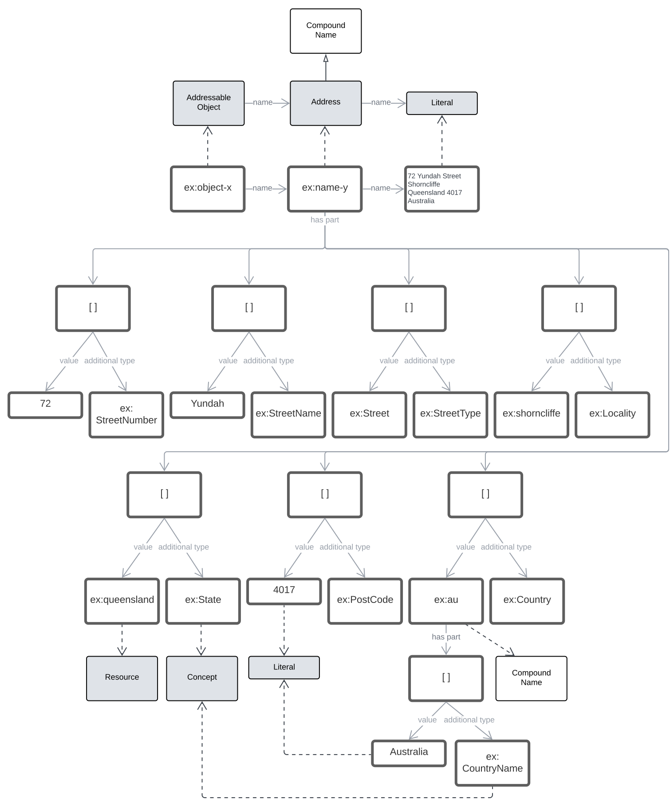

== Examples

These examples are figures based on the data for the example given for the <<CompoundName>> class description.

=== Address

[[fig-example1]]
.Example subclasses of `Resource` and corresponding `Compound Names`

=== Geographical Name

[[fig-example2]]
.Example subclasses of `Resource` and corresponding `Compound Names`
image::img/Example2.svg[width="60%"]