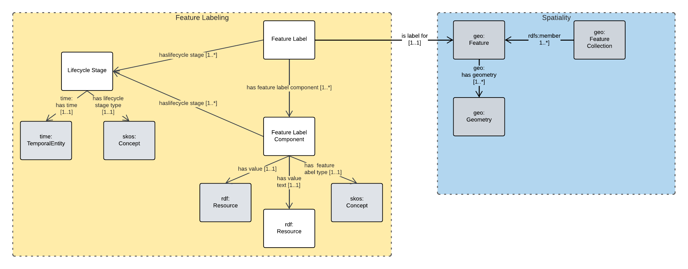

= Feature Labelling Model

[[fig-overview]]
.An informal Model Overview diagram showing the major elements of this model

This model allows for complex labels may be assigned to geospatial features.

The purpose of this model is to act as an "upper" or background model for specialised feature labelling models, such as models for addresses, roads, administrative areas/boundaries, place names etc.

== Metadata

|===
| Property | Value
| IRI | *https://linked.data.gov.au/def/fl*
| Name | Feature Labelling Model
| Description | This model allows for complex labels may be assigned to geospatial features
| Creator | https://orcid.org/0000-0002-8742-7730[Nicholas J. Car]
| Publisher | https://linked.data.gov.au/org/agldwg[Australian Government Linked Data Working Group]
| Date Created | 2023-04-26
| Date Modified | 2023-05-03
| Date Issued | 2023-04-26
| License | https://creativecommons.org/licenses/by/4.0/[Creative Commons BY 4.0]
|===

== Status

As of May, 2023, this model is in early version release

It is to be in use within the Queensland Address, Roads, Cadastre and the national Place Names Models by July, 2023.